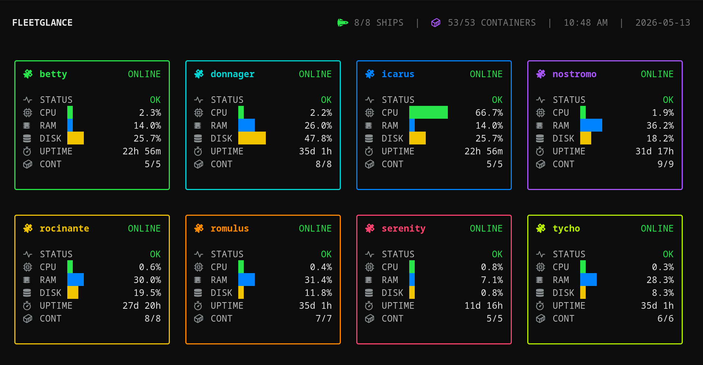
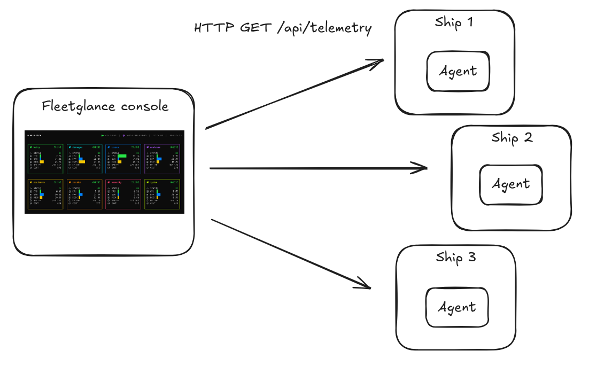

# Fleetglance

Fleetglance is a lightweight terminal console for viewing live telemetry from a small fleet of self-hosted Linux machines.

It runs an agent on each monitored machine and a console on a Linux machine with an attached display.



## Status

Fleetglance is in rapid development and is currently pre-release.

Expect breaking changes, incomplete documentation, and rough edges.

## Features

- Full-screen terminal fleet dashboard
- Agent-per-machine architecture
- Pull-based telemetry collection
- CPU, RAM, disk, uptime, and container status
- Simple YAML configuration
- Designed for a dedicated Linux display

## Current limitations

- Supports up to 8 ships in the current console layout.
- Designed for local/self-hosted networks.
- No authentication or TLS handling is provided by Fleetglance itself.
- Different theme and color pallete is not supported yet.

## Architecture

Fleetglance has two components:

- `fleetglance-agent` runs on each monitored machine.
- `fleetglance-console` runs on the display machine.

The console polls each configured agent over HTTP and renders the fleet status.



## Configuration

Example `fleetglance.yaml`:

```yaml
version: 1

pull_interval: 5s
timeout: 2s

ships:
  donnager:
    url: http://donnager.example.local:9800
  nostromo:
    url: http://nostromo.example.local:9800
  rocinante:
    url: http://rocinante.example.local:9800
```

## Installation

See:

- [Installation](docs/installation.md)
- [Running on a Linux machine with an attached display](docs/linux-display.md)

## Development

Common development flow:

```sh
make format
make lint
make test
```

Build locally:

```sh
make build
```

Build binaries for installation:

```sh
make build-release
```

Output release binaries will be placed in `dist/`

### Local Agent development & running

Place `.env` in root dir like the following:

```sh
PORT=9800
DEBUG=true
LOG_FORMAT=console
```

And run:

```sh
go run cmd/agent/main.go
```

### Local Console development & running

> Run agent in localhost first or on a deployed remote.

Place fleetglance.yaml config like the following:

```yaml
version: 1

pull_interval: 5s
timeout: 2s

ships:
  valkyrie:
    url: http://localhost:9800

```

And run:

```sh
go run cmd/console/main.go -f ./fleetglance.yaml
```

## License

MIT
